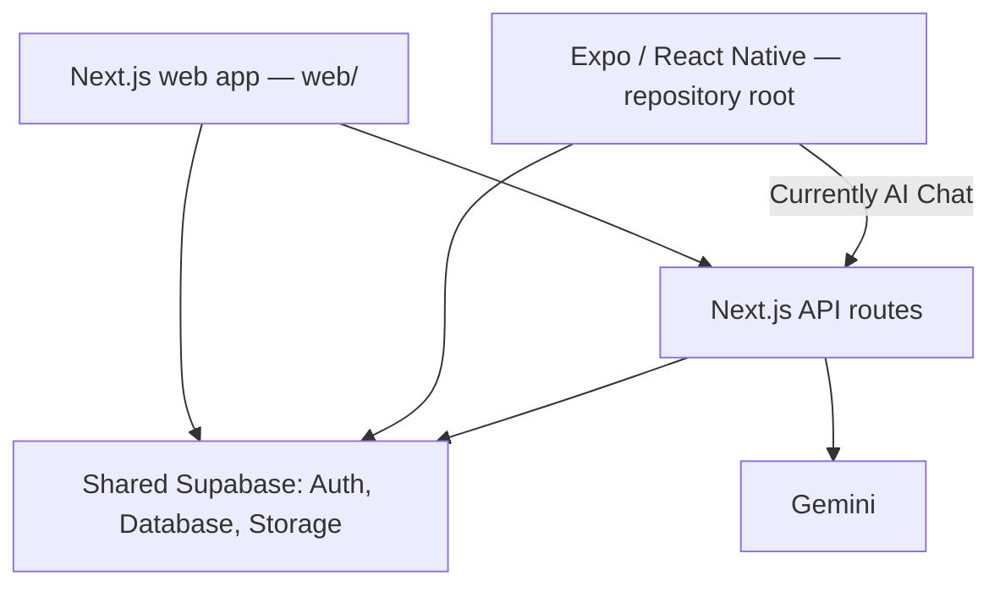

# School Buddy: app analysis and cross-platform plan

Document created: 25 September 2026  
Based on the repository review performed on 19 September 2026.

## Summary

School Buddy has two separate frontends sharing a Supabase backend:

- **Expo / React Native at the repository root:** iOS, Android, and an Expo browser target.
- **Next.js in `web/`:** the main web application and server API routes.

The web application currently has substantially more features than the native application. Sharing a database makes records available to both clients, but does not automatically share screens, validation, or business behavior.

**Recommendation:** keep Next.js and Expo, develop web first, and extract shared business rules, types, validation, translations, and API contracts. Keep privileged operations on the server. Build native interfaces against those same contracts as mobile work resumes.

## Review scope and limitations

The original review inspected screens, API routes, authentication, database migrations, configuration, and CI. It was a source-code review, not a live production security audit or device test.

Checks passed during that review:

- Root application TypeScript check.
- Web TypeScript check.
- Web ESLint check.
- Translation synchronization and missing-key check.

Production builds, native builds, deployed Supabase policies/settings, and live user workflows were not verified. Findings below describe checked-in code and migrations; deployed behavior depends on the actual database and configuration. These checks were not rerun merely to create this document. No application fixes were made as part of the review or this document.

## Current architecture



| Platform | Current position |
| --- | --- |
| Web browsers | Next.js application in `web/` |
| iOS | Expo configuration and EAS build profiles exist; device/release readiness not verified |
| Android | Expo configuration and EAS build profiles exist; device/release readiness not verified |
| Expo web | Separate browser build of the React Native application |
| Windows/macOS native desktop | No dedicated applications found |
| Offline/PWA | No implemented offline synchronization or PWA capability identified |

Running `npm run web` at the root starts **Expo web**, not Next.js. Run `npm run dev` inside `web/` for the Next.js application.

The product has four roles: administrator, vice principal, teacher, and student. It models a class group with a shared roster, subject offerings within that class, assignments, submissions, materials, and schedules. The current subject model assigns one teacher to a subject across the school.

## Feature inventory

“Implemented” means implementation exists in source, not that every workflow has been verified in production. Platform implementations are not necessarily identical.

| Feature | Next.js web | React Native app |
| --- | --- | --- |
| Email/password login, persisted sessions, logout | Implemented | Implemented |
| Administrator-provisioned accounts; no signup screen | Yes | Yes |
| Password-reset email request | Implemented; recovery completion missing | Implemented; recovery completion missing |
| Admin, vice principal, teacher, student roles | Implemented | Implemented |
| Role-specific dashboards and navigation | Implemented | Implemented |
| Settings and language selection | Implemented | Implemented |
| English, Hindi, Telugu UI | Broad coverage; some untranslated screens/text | Broad coverage |
| Create teacher/student accounts | Implemented | Missing |
| Restrict/unrestrict accounts and set passwords | Implemented | Missing |
| Create classes, assign subjects, manage rosters | Admin/VP controls | Missing management UI |
| Delete whole classes | Admin control | Missing |
| Teacher classes and read-only rosters | Implemented | Implemented |
| Teacher aggregate student list | Implemented | Implemented |
| Individual student assignment/grade/performance page | Implemented | Missing |
| Student enrolled subjects | Implemented | Implemented |
| Basic teacher-created assignments | Implemented | Implemented |
| Homework, test, discussion, revision types | Implemented | Implemented |
| Difficulty and due dates | Implemented | Implemented |
| End, reopen, cancel, delete assignments | Implemented | Missing |
| Student freeform and MCQ submissions | Implemented | Missing |
| Automatic MCQ grading | Implemented; integrity issues below | Missing submission UI |
| Manual grading, feedback, rubric scoring | Implemented | Missing |
| Performance history, average scores, pass rates | Implemented | Missing |
| Weekly timetable and schedule editing | Implemented | Missing |
| PDF/image materials and multiple-image uploads | Implemented | Missing |
| AI material extraction and summaries | Implemented | Missing |
| AI-generated MCQs and freeform assignments with rubrics | Implemented | Missing |
| Review/edit AI drafts before publishing | Implemented | Missing |
| AI chat | Implemented | Implemented through web API |
| Chat history, reopen/delete conversations | Implemented | Implemented |
| Markdown responses and read-aloud | Browser speech | Native speech |
| Exams | Placeholder | Missing |
| Learning videos | Placeholder | Missing |

AI chat does not retrieve uploaded school materials when answering. Material-based assignment generation is a separate capability. Live voice conversation, push notifications, offline synchronization, and individual/group assignment targeting are not implemented.

## Priority security and data-integrity findings

### 1. Critical: students can supply grading fields through direct inserts

The submission insert policy checks student identity and enrollment, but does not restrict fields including `score`, `passed`, `status`, and `graded_at`. An enrolled student can bypass the submission API and submit grading values directly through Supabase. This path also bypasses the API's closed-assignment check.

**Fix:** enforce submission creation through a trusted server/database operation. Reject client-supplied grading fields, check enrollment and assignment status, and enforce score constraints in the database. Ensure direct table access cannot bypass these rules.

**Verify:** a student cannot insert a grade, submit after closure/cancellation, or submit for another student or unenrolled class.

Evidence: [submission policies](../supabase/migrations/0011_submissions.sql).

### 2. High: MCQ scoring accepts duplicate answers

The submission endpoint counts matching items in the submitted array. Repeating one correct answer can inflate the score above the intended result or maximum. Assignment read access is also treated as sufficient authorization before a privileged submission insert, although teachers and staff can read assignments.

**Fix:** explicitly require an enrolled student; validate unique question IDs and integer option indexes within range; score by iterating the assignment's questions exactly once. Reject unknown and duplicate question IDs.

**Verify:** duplicates and malformed answers are rejected, scores remain within bounds, and non-student callers cannot submit through the privileged path.

Evidence: [submission endpoint](../web/app/api/submissions/submit/route.ts).

### 3. High: extraction trusts a client-writable storage path

Teachers can set `material_files.file_path` for their own materials. The policy does not bind that path to the material's class. Extraction downloads the path using a service-role client. Knowledge of another material's path could therefore allow access outside the caller's normal storage permissions.

**Fix:** download with the caller's RLS-protected client and validate the class/material path relationship. Enforce file counts, MIME types, and total size on the server as well as in the UI.

**Verify:** a material referencing another class's storage object is rejected before download or AI processing.

Evidence: [material-file policies](../supabase/migrations/0016_material_files.sql), [extraction endpoint](../web/app/api/materials/extract/route.ts).

### 4. High: chat messages are not securely bound to session ownership

The chat route scopes its session update by owner but does not confirm a matching session before inserting messages with service-role privileges. The message policy checks the message's `user_id` without verifying ownership of the parent session. This is an ownership/integrity gap; it does not by itself demonstrate that other users' messages can be read.

**Fix:** verify session ownership before generating or saving a turn, and enforce the parent-session ownership relationship in database policies or constraints. Remove direct client message writes if messages are intended to be server-written only.

**Verify:** a caller cannot attach messages to another user's session through either the API or direct database requests.

Evidence: [chat endpoint](../web/app/api/chat/route.ts), [chat policies](../supabase/migrations/0019_ai_chat_history.sql).

### 5. High, conditional: signup metadata can grant elevated roles

The new-user trigger accepts `admin` and `vice_principal` from user metadata. A missing signup screen does not disable direct Supabase signup requests. Exploitability depends on the external public-signup configuration, which was not verified.

**Fix:** verify public signup is disabled for this provisioned-account product. Assign elevated roles through trusted provisioning logic rather than user-controlled signup metadata.

**Verify:** a public signup request cannot create an elevated profile, regardless of submitted metadata.

Evidence: [new-user trigger](../supabase/migrations/0013_vice_principal.sql).

### 6. High before multiple schools: school isolation is incomplete

Several staff policies grant access based on role alone. Password/restriction endpoints do not check the target's school, and the new-user trigger assigns accounts to the first school. Existing `school_id` fields are a foundation, not complete tenant isolation.

**Fix:** enforce school membership in RLS and privileged routes, assign the intended school during provisioning, and validate cross-table school relationships.

**Verify:** staff in school A cannot read or modify school B's accounts, classes, rosters, assignments, materials, or grades.

Evidence: [staff policies and provisioning](../supabase/migrations/0013_vice_principal.sql), [class-management policies](../supabase/migrations/0015_admin_controls_classes.sql), [password endpoint](../web/app/api/admin/set-password/route.ts), [restriction endpoint](../web/app/api/admin/set-restricted/route.ts).

## Functional and maintenance issues

| Issue | Impact | Recommended action |
| --- | --- | --- |
| Grade release is mainly enforced in presentation logic | API/database responses can expose grades before assignment end | Enforce release rules at the server/database boundary |
| Password recovery lacks a completed callback/new-password flow | Users can request mail without completing recovery in the implemented app | Add web recovery handling and native deep-link recovery |
| Mobile ignores assignment `status` | Ended/cancelled assignments can appear with ordinary due-date badges | Share assignment types and effective-status rules |
| Assignment and answer key publish separately | Failure can leave a visible test without a key | Publish atomically in a database transaction |
| Rate limiting uses separate count/insert operations and ignores database errors | Concurrent requests can exceed limits; failures can disable enforcement | Use atomic enforcement, explicit failure behavior, and input/token limits |
| Subject setup exists only during teacher onboarding | Skipped/failed setup has no repair interface | Add subject assignment and reassignment management |
| One teacher per subject across a school | Multiple teachers teaching the same subject across classes are difficult to represent | Decide the intended model; consider teacher assignment per offering |
| One subject per teacher is assumed but not enforced | Queries using `maybeSingle()` can fail for teachers with multiple subjects | Enforce the intended rule or support multiple subjects consistently |
| CI checks only root TypeScript | Web, translation, build, and authorization regressions can pass | Extend CI to both apps and critical database/API behavior |
| Documentation contains stale statements | Readers can mistake implemented features for missing ones | Update READMEs alongside a maintained parity inventory |

Relevant examples: [mobile assignment list](../app/(app)/assignments.tsx), [web assignment rules](../web/components/assignments/types.ts), [AI test publishing](../web/components/assignments/GenerateAssignmentForm.tsx), [rate limiter](../web/lib/aiRateLimit.ts).

### AI model configuration

The reviewed AI routes default to `gemini-2.0-flash`. Google's deprecation table consulted during the review listed June 1, 2026 as its shutdown date. Verify the deployed `GEMINI_MODEL` override, replace the obsolete default with a supported model, and test extraction, generation, and response validation. Private environment values were not inspected.

Source: [Google Gemini model lifecycle documentation](https://ai.google.dev/gemini-api/docs/deprecations). Model availability changes; consult the current table when implementing this fix.

## Recommended shared architecture

Keep platform interfaces separate while moving reusable behavior into workspace packages. Expo supports workspace-based monorepos: [official Expo guide](https://docs.expo.dev/guides/monorepos/).

An eventual structure:

```text
apps/
  web/                  Next.js screens and server routes
  mobile/               Expo / React Native screens
packages/
  domain/               Roles, assignment rules, validation, shared types
  api-client/           Typed calls used by both apps
  i18n/                 Shared translation dictionaries
  design-tokens/        Colours, spacing, typography values
supabase/
  migrations/           Shared schema and authorization
```

Moving application directories is not a prerequisite. Extract shared behavior incrementally before undertaking a larger directory migration. Keep platform dependencies compatible with each framework; do not force React or Supabase dependency versions to match merely because the apps share a repository.

### What should be shared

- Domain types and generated database types.
- Assignment status, due-date, and validation rules.
- API request/response schemas and a typed API client.
- Role/capability definitions for consistent presentation; actual authorization remains server/database enforced.
- Translation dictionaries and compatible formatting rules.
- Design-token values where useful.
- Tests for shared behavior and backend authorization.

### What stays platform-specific

- Next.js pages, server rendering, browser elements, and CSS.
- React Native screens, navigation, and native controls.
- Session persistence and platform authentication adapters.
- File picking, speech, deep linking, and other device/browser integrations.

The existing chat route demonstrates cookie authentication for web and bearer-token authentication for mobile. Generalize this approach to other protected endpoints, with explicit role, ownership, and school checks after authentication.

Mobile does not need a separate server or a service-role key for administration, submissions, or AI generation. It can call the same protected backend. Never include server secrets in shared client packages or mobile bundles.

## What a web change means for mobile

| Change | Expected cross-platform effect |
| --- | --- |
| Server scoring or authorization fix | Both callers use corrected server behavior |
| Shared assignment lifecycle rule | Both clients use the same implementation after consuming/releasing the update |
| Typed API contract change | Type checks reveal incompatible callers where the contract is used |
| Shared translations/design tokens | Both clients consume the common source; native changes still need distribution |
| New Next.js page or interaction | A React Native interface still needs implementation |
| New backend capability | Native can use it when its calling flow/interface is built |

Shared source does not update already installed mobile binaries automatically. Maintain backward-compatible API/database changes for supported app versions and use an appropriate release process for native changes.

Example workflow for rubric grading:

1. Define rubric types and validation in shared code.
2. Implement authorized scoring and persistence on the backend.
3. Build the Next.js grading interface now.
4. Build the React Native interface later against the same contract.

If immediate phone access to new features is needed while native development is deferred, prioritize responsive Next.js pages. This provides browser access on phones; it does not automatically add the feature to the native application.

## Implementation sequence

| Stage | Work | Completion criteria |
| --- | --- | --- |
| 1. Protect core workflows | Fix submission integrity, privileged access, chat ownership, and provisioning risks | Negative authorization tests pass; direct database access cannot bypass critical rules |
| 2. Share core behavior | Extract assignment types/status, roles, validation, and database types | Both apps consume common rules; mobile represents ended/cancelled assignments correctly |
| 3. Unify backend access | Consistent cookie/bearer authentication and typed APIs | Web and native callers receive equivalent authorized behavior |
| 4. Improve verification | CI for both apps, translations, builds, and critical API/database tests | Pull requests check all affected applications and shared behavior |
| 5. Continue web-first delivery | Build new web features on shared contracts and track parity explicitly | Every feature records native status and API compatibility requirements |
| 6. Close mobile gaps | Submissions, grades, lifecycle first; timetable, materials, administration next | Each native workflow satisfies the same backend acceptance criteria as web |

Stages can overlap where safe, but assessment integrity and access controls should precede use with real student assessments.

## Decisions to settle during implementation

- Is the near-term product intentionally single-school, or must it support multiple schools?
- Can a teacher teach multiple subjects, and can a subject have different teachers per class?
- Which web-only features are required for the first native release?
- Is responsive browser access sufficient while native interfaces are deferred?
- When exactly should grades and feedback become visible, including cancelled or reopened assignments?
- Which installed mobile versions must remain compatible with future backend changes?

Keep this document as a baseline. Update the feature table and mark findings resolved only after implementation and verification, rather than treating planned work as completed.
